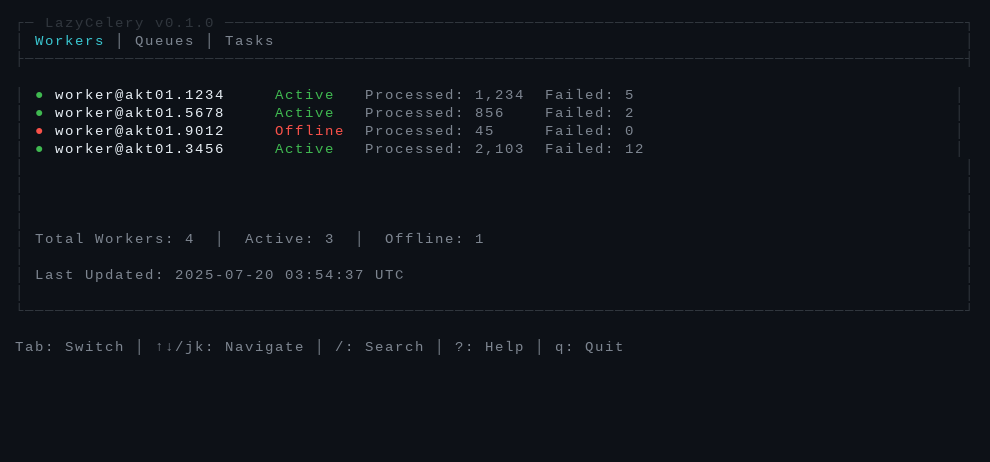
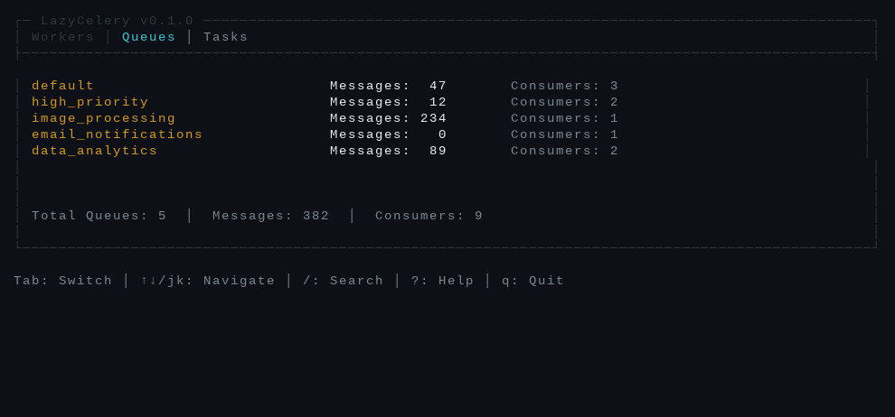
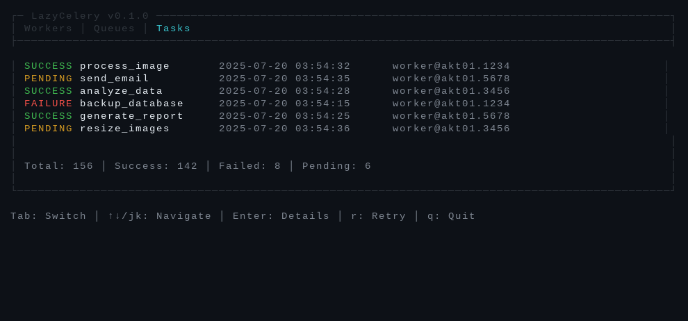
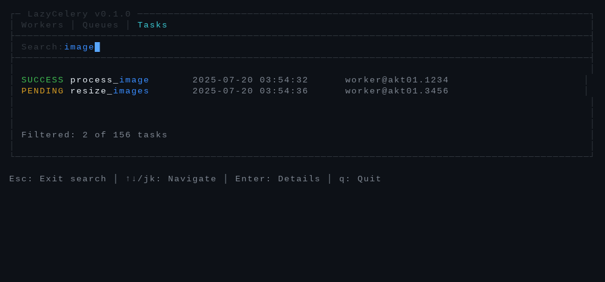
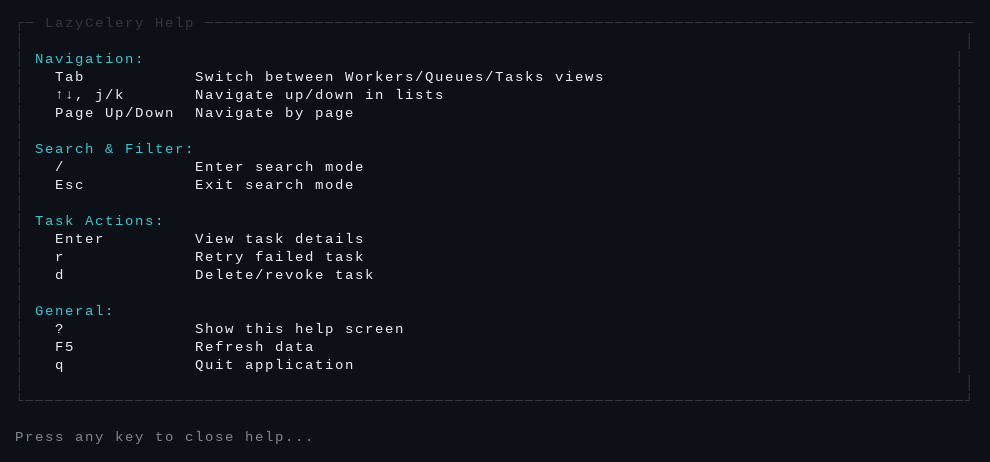

# LazyCelery

[](https://github.com/fguedes90/lazycelery/actions/workflows/ci.yml)
[](https://github.com/fguedes90/lazycelery/releases)
[](https://opensource.org/licenses/MIT)
[](https://crates.io/crates/lazycelery)

A terminal UI for monitoring and managing Celery workers and tasks, inspired by lazydocker and lazygit.

## Features

- Real-time worker monitoring
- Queue management with message counts
- Task listing with status tracking
- Search and filter capabilities
- Keyboard-driven interface

## Screenshots

### Main Dashboard - Workers View


### Queue Management


### Task Monitoring


### Search Mode


### Help Screen


## Installation

Choose your preferred installation method:

### 🦀 Cargo (Rust)

```bash
cargo install lazycelery
```

### 🍺 Homebrew (macOS/Linux)

```bash
brew tap Fguedes90/tap
brew install lazycelery
```

### 📦 Arch Linux (AUR)

```bash
# Source package (builds from source)
yay -S lazycelery

# Binary package (faster install)
yay -S lazycelery-bin
```

### 🪣 Scoop (Windows)

```bash
scoop bucket add lazycelery https://github.com/Fguedes90/scoop-bucket.git
scoop install lazycelery
```

### 🍫 Chocolatey (Windows)

```bash
choco install lazycelery
```

### 📱 Snap (Linux)

```bash
snap install lazycelery
```

### 📥 Binary Download

Download pre-built binaries from [GitHub Releases](https://github.com/Fguedes90/lazycelery/releases):

- **Linux x86_64**: `lazycelery-linux-x86_64.tar.gz`
- **macOS x86_64**: `lazycelery-macos-x86_64.tar.gz`  
- **macOS ARM64**: `lazycelery-macos-aarch64.tar.gz`
- **Windows x86_64**: `lazycelery-windows-x86_64.zip`

### 🔧 From Source

```bash
# Clone the repository
git clone https://github.com/fguedes90/lazycelery.git
cd lazycelery

# Install mise (task runner)
./scripts/install-mise.sh

# Setup development environment
mise run setup

# Build release binary
mise run release
```

## Usage

```bash
# Connect to Redis broker
lazycelery --broker redis://localhost:6379/0

# Use configuration file
lazycelery --config ~/.config/lazycelery/config.toml
```

## Keyboard Shortcuts

- `Tab` - Switch between Workers/Queues/Tasks
- `↑/↓` or `j/k` - Navigate items
- `/` - Search mode
- `?` - Show help
- `q` - Quit

## Development

### Prerequisites

- Rust 1.70.0 or later
- Redis (for testing)
- [mise](https://mise.jdx.dev/) (task runner)

### Quick Start

```bash
# Install mise if you haven't already
./scripts/install-mise.sh

# Setup development environment
mise run setup

# Run with auto-reload
mise run dev

# Run tests in watch mode
mise run test-watch
```

### Available Tasks

```bash
mise tasks              # Show all available tasks
mise run build         # Build release binary
mise run dev           # Run with auto-reload
mise run test          # Run tests
mise run lint          # Run linter
mise run fmt           # Format code
mise run audit         # Security audit
mise run coverage      # Generate coverage report
mise run docs          # Generate documentation
```

### Pre-commit Checks

Before committing, run:

```bash
mise run pre-commit
```

This runs formatting, linting, tests, and security audit.

## Contributing

See [CONTRIBUTING.md](CONTRIBUTING.md) for guidelines.

## Specifications

See `specs/` directory for detailed specifications and planned features.

